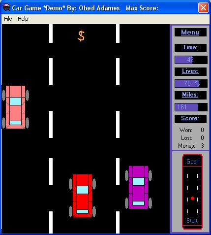



## Car Game Demo

### Description

This is a simple car game, (made whith shapes and frames). In the game you can change the color of the car and also the time in day, night and dawn. I hope you like, it is simple but fun.
 
### More Info
 

             |
---                |---
**Submitted On**   |2004-06-06 02:01:42
**By**             |[\_Obed\_](https://github.com/Planet-Source-Code/PSCIndex/blob/master/ByAuthor/obed.md)
**Level**          |Beginner
**User Rating**    |4.9 (263 globes from 54 users)
**Compatibility**  |VB 6\.0
**Category**       |[Games](https://github.com/Planet-Source-Code/PSCIndex/blob/master/ByCategory/games__1-38.md)
**World**          |[Visual Basic](https://github.com/Planet-Source-Code/PSCIndex/blob/master/ByWorld/visual-basic.md)
**Archive File**   |[Car\_Game\_D175441662004\.zip](https://github.com/Planet-Source-Code/obed-car-game-demo__1-54211/archive/master.zip)

